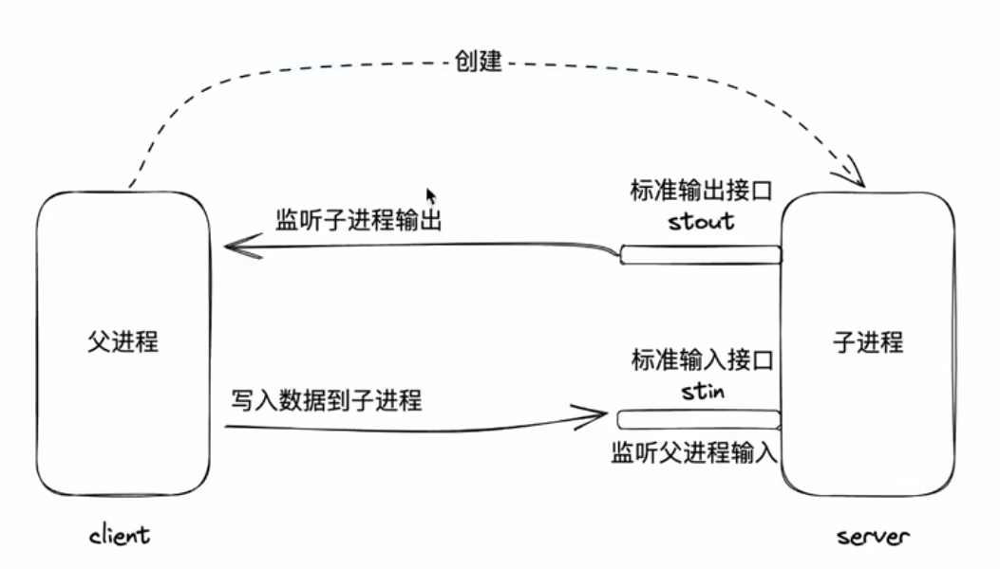

# MCP
> MCP（Model Context Protocol）模型上下文协议，是一个开源标准的协议，其核心目标是让AI应用能够顺畅、安全地连接和交互外部系统和数据源。
## 介绍

个人理解就是AI模型是语言模型，输出的是文本，无权限无法直接读写文件或执行系统命令的，而MCP可以将这些能力封装成一个MCP Server，暴露成标准接口。AI应用（MCP Client）可以自动发现有哪些工具，然后按需调用。

**例如：**

1、问AI应用，今天的天气怎么样？我应该穿什么衣服？

AI是不能实时获取到天气的，但是有了MCP了之后，AI可以通过MCP获取到当前的天气，然后给出建议。

2、让AI应用，创建一个文本，内容为xxx

AI应用是不能直接创建文件的，但是可以通过MCP封装成方法，供AI应用进行调用

那么问题来了，我们平时用的智能体明明是可以给我们修改代码，跑命令的，怎么能说AI应用做不了创建文件的。我也很好奇，问了AI后得到了答案。

那就是因为AI并不能直接创建文件，而是背后的智能体框架或插件在操作，不同的AI应用内部有自己不同的实现方法，而MCP是协议，**提供标准化、安全、可发现、跨平台的工具调用机制**，随着MCP生态成熟，任何AI应用只要接入标准的MCP Server，就能立即获得读写文件、调用API、访问数据库等能力。

## 前置知识
### 通信方式：stdio
stdio: standard input and output标准输入输出

MCP使用stdio作为通信方式，MCP Client和MCP Server通过标准输入输出进行通信。MCP消息是JSON格式，通过stdin发送请求，通过stdout接收响应。

stdio是一种常见的进程间通信方式，它允许进程之间通过标准输入输出进行通信。

### stdin

```js
process.stdout.write(process.pid + 'Hello, World!\n')
```
执行 node index.js
终端输出了26868Hello, World!
这个时候，终端作为父进程，创建了子进程，子进程通过标准输出接口stdout输出了26868Hello, World!,终端监听子进程的输出

### stdout

```js
process.stdin.on('data', function (data) {
  process.stdout.write('回复: ' + data)
})
```
执行 node index.js
终端输入任意字符，终端会输出：回复: xxx
而且此时进程不会结束，因为stdin监听了数据，所以进程不会结束



### stdio 示例
通过终端启动下面的进程，然后该进程又启动了一个子进程，子进程通过标准输入输出接口stdio与父进程进行通信。

> client.js

```js
import { spawn } from 'child_process'

// 启动 server.js 子进程
const serverProcess = spawn('node', ['server.js'])

// 监听 server.js 的输出
serverProcess.stdout.on('data', (data) => {
  console.log('server.js 输出:', data.toString().trim())
})

// 发送几条测试数据
for (let i = 0; i < 3; i++) {
  serverProcess.stdin.write(`测试数据 ${i}\n`)
}

```
> server.js

```js
process.stdin.on('data', function (data) {
  process.stdout.write('回复: ' + data)
})
```
stdio通信高效、简洁，但仅适用于本地进程间的通信

### 通信格式：JSON-RPC
RPC(Remote procedure call)

request
```js
{
  "jsonrpc": "2.0",
  "method": "echo",
  "params": {
    "message": "Hello, World!"
  },
  "id": 1
}
```

response
```js
{
  "jsonrpc": "2.0",
  "result": "Hello, World!",
  "id": 1
}
```

## MCP
MCP（Model Context Protocol）模型上下文协议，是一个开源标准的协议，其核心目标是让AI应用能够顺畅、安全地连接和交互外部系统和数据源。

如何通信
+ 通信方式
- stdio 本地进程间通信
- http 可远程

+ 通信格式：基于JSON-RPC的规范

### 基本规范

#### 1、初始化 initialize

```js
{
  "jsonrpc": "2.0",
  "method": "initialize",
  "params": {
    "model": "gpt-3.5-turbo",
    "api_key": "sk-1234567890abcdef1234567890abcdef"
  },
  "id": 1
}
```

#### 2、工具发现 tools/list
```js
{
  "jsonrpc": "2.0",
  "method": "tools/list",
  "params": {},
  "id": 2
}
```

####  3、工具调用

```js
{
  "jsonrpc": "2.0",
  "method": "tools/call",
  "params": {
    "name": "create_file",
    "arguments": {
      "file_name": "test.txt",
    }
  },
  "id": 3
}
```
### 工具
#### MCP Inspector
MCP Inspector是一个MCP协议的调试工具，用于调试MCP Server和MCP Client之间的通信。

npx @modelcontextprotocol/inspector

#### MCP SDK
MCP SDK是MCP协议的开发工具包，用于快速开发MCP Server和MCP Client。

npm install @modelcontextprotocol/sdk

示例

```js
import { McpServer } from '@modelcontextprotocol/sdk/server/mcp.js'
import { StdioServerTransport } from '@modelcontextprotocol/sdk/server/stdio.js'
import * as z from 'zod/v4'

const mcpServer = new McpServer({
  name: 'tools-with-sample-server',
  version: '1.0.0',
})

// Tool that uses LLM sampling to summarize any text
mcpServer.registerTool(
  'summarize',
  {
    description: 'Summarize any text using an LLM',
    inputSchema: {
      text: z.string().describe('Text to summarize'),
    },
  },
  async ({ text }) => {
    // Call the LLM through MCP sampling
    const response = await mcpServer.server.createMessage({
      messages: [
        {
          role: 'user',
          content: {
            type: 'text',
            text: `Please summarize the following text concisely:\n\n${text}`,
          },
        },
      ],
      maxTokens: 500,
    })

    // Since we're not passing tools param to createMessage, response.content is single content
    return {
      content: [
        {
          type: 'text',
          text:
            response.content.type === 'text'
              ? response.content.text
              : 'Unable to generate summary',
        },
      ],
    }
  }
)

async function main() {
  const transport = new StdioServerTransport()
  await mcpServer.connect(transport)
  console.log('MCP server is running...')
}

main().catch((error) => {
  console.error('Server error:', error)
  process.exit(1)
})
```

两个核心概念

**MCP Host** ：往往指代AI应用本身，用于发现MCP Server以及其中的工具列表

**MCP Client**：用于和MCPserver 通信的客户端，往往在HOST内部开启，通常情况下，每启动一个MCP Server，就会开启一个MCP Client

##  项目实战-安全依赖审计工具


## 参考

[modelcontextprotocol官网](https://modelcontextprotocol.io)

[火爆全网的MCP全解读，前置知识先知道【渡一教育】](https://www.bilibili.com/video/BV1qkYpzZEQ8?spm_id_from=333.788.videopod.sections&vd_source=0f54cda2e81d3c6795a9a797a6afee39)

```
